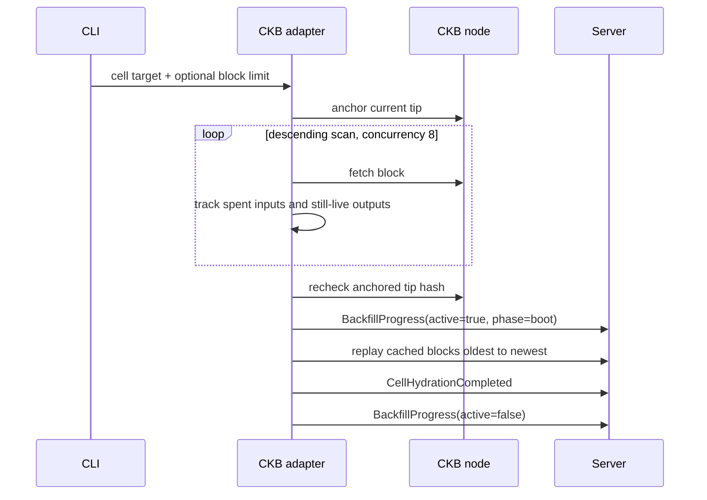
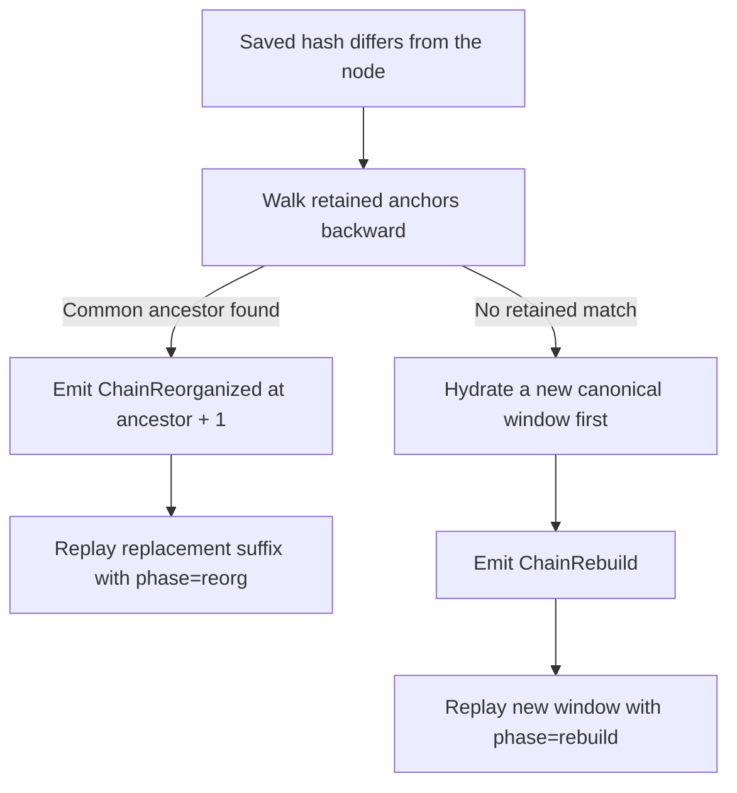

# cknerv Design and Architecture

## 1. System Purpose

cknerv is a local-first, read-only CKB chain visualization stack. Its default
deployment is one local process that:

- reads blocks, transactions, mempool state, synchronization state, and P2P
  information from a local or user-selected CKB JSON-RPC node;
- translates source data into mutations that do not expose adapter-specific
  RPC shapes;
- maintains chain entities and projections such as CellGalaxy in memory;
- serves snapshots over HTTP and incremental updates over WebSocket;
- persists derived state in the work directory so the next run can resume;
- hosts an embedded React/Three.js SPA that renders Cells, causal links, and
  the observed node network.

The CKB node is the sole source of structural truth. Optional ckbadger data may
add indexed semantics and display candidates, but it cannot decide block,
transaction, Cell lifecycle, or reorganization outcomes. Every ckbadger
candidate admitted to the CellGalaxy display plane is rehydrated and verified
against the local CKB node first.

### 1.1 Design Goals

- **Intuitive Visualization**: make the semantics, structure, and live dynamics
  of the Common Knowledge Base immediately legible through direct, interactive
  visual representations.
- **Cinematic Presentation**: create a cohesive, high-fidelity visual experience
  through deliberate scene composition and expressive motion while preserving
  semantic clarity and rendering efficiency.
- **CKB Native**: expose Cell birth, consumption, capacity, script taxonomy,
  and transaction causality directly.
- **Local First**: require only a CKB RPC endpoint and a local browser on the
  default path; avoid hosted middleware assumptions.

### 1.2 Non-goals and Boundaries

- cknerv does not submit transactions or call mutating CKB RPC methods.
- ckbadger and browser caches are never canonical truth.
- `cknerv-core` does not contain CKB RPC, axum, React, or source-specific
  adapter logic.
- `cknerv-server` does not interpret CKB JSON-RPC structures.
- cknerv does not retain complete chain history; it is a bounded live
  observation and visualization system.

## 2. Overall Architecture

```mermaid
flowchart LR
    CKB[CKB JSON-RPC<br/>canonical truth]
    BADGER[ckbadger API<br/>optional semantics/index]

    A[cknerv-adapter-ckb]
    E[cknerv-adapter-ckbadger]
    M[Mutation pipeline]
    EM[EnrichmentEvent pipeline]
    S[cknerv-server<br/>entities + projection registry]
    P[(derived state JSON)]
    API[HTTP snapshots + WebSocket deltas]
    CACHE[@cknerv/cache]
    UI[@cknerv/ui + ui-app]

    CKB --> A --> M --> S
    BADGER --> E --> EM --> S
    E -. candidate outpoints .-> A
    S <--> P
    S --> API --> CACHE --> UI
```

The system has three logically separate data planes:

| Plane | Source and responsibility | Canonical | Persisted |
|---|---|---:|---:|
| Structural | CKB observations reduced through `Mutation` into chain entities, Cell lifecycle, and causal links | Yes | Yes |
| Display | The CellGalaxy display plane decides which Cells are on stage | No; presentation policy only | No; rebuilt after restore |
| Semantic | Optional `EnrichmentEvent` records provide detail and aggregate context | No; anchored to canonical evidence | No |

The UI may combine these planes, but they cannot contaminate one another.
Display membership changes never alter birth/death counters, semantic failures
never block CKB ingestion, and an external index cannot create a canonical
Cell.

### 2.1 Architecture Invariants

| Invariant | Constraint |
|---|---|
| I1: one structural truth | Only read-only observations from the CKB node may determine structural entities, Cell lifecycle, and causal links |
| I2: display isolation | The display plane never writes the canonical map or counters and is not persisted |
| I3: self-contained enters | A snapshot carries the staged rows, and every display enter carries its Cell record — the wire never asks a client to remember a cell it was not sent. Canonical deltas at a revision still precede the display delta that follows them |
| I4: OutPoint uniqueness | One outpoint cannot be staged simultaneously under canonical and resident identities |
| I5: anchor validation | External semantic records must still match retained canonical evidence after loading and immediately before commit |
| I6: determinism | Wire-visible order, positions, and timestamps come from ordered state and mutations, not reducer wall-clock reads |
| I7: bounded degradation | Rings, projections, refreshes, display, and GPU resources use explicit resync, rebuild, or cap behavior instead of silent guesses |

## 3. Repository Layers and Dependency Direction

| Directory | Responsibility | Allowed dependencies | Must not own |
|---|---|---|---|
| `crates/cknerv-core/` | Chain-generic entities, mutations, projection traits, CellGalaxy, semantic projection, helix, ring | General-purpose libraries such as serde | CKB RPC, axum, browser logic |
| `crates/cknerv-adapter-ckb/` | CKB JSON-RPC, boot hydration, tip following, reorg detection, script taxonomy | `cknerv-core`, CKB types, HTTP client | Server state and UI policy |
| `crates/cknerv-server/` | Adapter trait, reducers, projection registry, HTTP/WS, persistence, enrichment scheduling | `cknerv-core`, axum, tokio | CKB RPC shapes |
| `crates/cknerv-adapter-ckbadger/` | Optional indexed semantics, aggregate panels, display-candidate discovery | Core/server source interfaces | Canonical structural truth |
| `crates/cknerv-cli/` | Commands, config merge, component assembly, SPA embedding, process lifecycle | All Rust runtime components | New domain rules |
| `packages/types/` | TypeScript twins of Rust wire shapes | No business-layer dependency | Reducers and rendering |
| `packages/cache/` | Pure reducers, snapshot decoding, WS connectors, incremental SoA | `@cknerv/types` | Three.js and direct RPC |
| `packages/ui/` | R3F scenes, geometry, materials, HUD, interaction, visual derives | types/cache | Rust internals and node RPC |
| `ui-app/` | Default dashboard composition, boot, route state, runtime config | types/cache/ui | Duplicate server projections |
| `tests/fixtures/` | Shared Rust/TypeScript wire fixtures | Tests on both sides | Runtime state |

The primary dependency direction is:

```text
CKB / ckbadger
      │
      ▼
adapters ──► core contracts ◄── server
                              │
                              ▼ HTTP / WS
types ──► cache ──► ui ──► ui-app
```

`cknerv-cli` is the composition root. It may depend on and assemble every Rust
runtime component, but domain layers must not depend back on the CLI.

## 4. Core Domain Model

### 4.1 Entity, Mutation, and Projection

The backend follows an event-reduction model:

1. An Adapter emits `Mutation` values and never edits server state directly.
2. The server assigns a global `revision` to each mutation.
3. Inside one ordered critical section, it applies the mutation to entities
   and fans it out to all canonical projections.
4. Each Projection applies the mutation and emits zero or more projection
   deltas.
5. A snapshot is a complete materialization of current reducer state; deltas
   are the incremental form of the same state machine.

The `Projection` trait defines a name, JSON snapshot, optional binary snapshot,
mutation application, save, and load. The server therefore understands the
projection interface without knowing CellGalaxy business rules.

Current chain entities include:

- `Chain`: tip, recent blocks and transactions, cumulative block/transaction
  counts, mempool, epoch, median time, difficulty, chain name, reorg count,
  interval/transaction-count/block-size rings, IBD state, and best-known block;
- `ChainNode`: id, label, miner flag, version, and connection count for an
  observed node;
- `Peer`: the observed node's current P2P peer snapshot.

### 4.2 Mutation Categories

| Category | Main mutations | Purpose |
|---|---|---|
| Blocks and transactions | `BlockMined`, `TxLanded` | Advance chain entities and drive Cells, links, and pulses |
| Canonical correction | `ChainReorganized`, `ChainRebuild` | Roll back a proven suffix or discard an unprovable derived window |
| Chain snapshots | `ChainMempoolUpdated`, `ChainInfoUpdated` | Replace the latest node-level snapshot |
| Cell metadata | `CellTagged`, `CellHydrationCompleted` | Tag a Cell and record hydration coverage |
| Topology state | `ChainNodeRegistered`, `PeersUpdated`, `ChainSyncUpdated`, `ChainNodeInfoUpdated` | Update local-node and P2P views |
| Replay control | `BackfillProgress` | Report boot/catchup/reorg/rebuild progress and suppress historical pulses |
| Server-internal display | `GalaxyReservoirReplaced`, `GalaxyReservoirToppedUp` | Update display membership atomically in the canonical revision sequence without entering the entity wire |

`BackfillProgress` travels through the backend mutation pipeline, but the
frontend chain reducer does not consume it. The browser receives replay state
through CellGalaxy `backfill` deltas. The two Galaxy reservoir mutations exist
only inside the server. They can create gaps in the entity revision stream, so
all cursor logic compares monotonic revisions and never assumes contiguity.

### 4.3 Cell and OutPoint

A canonical Cell is created from a real CKB output. Its core fields are:

- an id that increases monotonically and continues across process restarts;
- `out_point = tx_hash + output_index`;
- `born_at_ms`, nullable `death_at_ms`, and `birth_block`;
- CKB capacity in shannons;
- bounded `data_hex`;
- the CKB-canonical content hash of the complete `CellOutput + data`;
- `lock_kind` and `asset_kind` classifications;
- `lock_script` and optional `type_script`, each a `ScriptId` carrying the
  `(code_hash, hash_type)` pair verbatim from the node;
- an id-derived `pos_seed`;
- an optional opaque tag.

Cellbase uses a dedicated sentinel previous output, which the projection does
not interpret as a normal Cell spend. Script taxonomy is a deterministic map
of known code-hash/hash-type pairs. Unknown scripts remain `other`; no fallback
classification chain invents a value.

The `_kind` enums and `ScriptId` answer two different questions and are not
interchangeable. The enums are cknerv's own coarse classification over the
handful of code hashes it pins itself — small, fixed, and what the renderer and
the composition policy read. `ScriptId` is the script's actual identity,
classified by nobody, so it is complete by construction: it is what the script
census counts and what an index can turn into a name. Measured against
ckbadger's catalogue the four pinned lock families cover 59.8% of mainnet's
live cells and the five asset families 33.4%, which is why the identity had to
stop being derivable from the family. (`Object` and `Identity` have since made
it seven; the argument is unchanged — the chain deploys script families faster
than anyone pins them.) `ScriptId` is unset on Cells restored
from state written before it existed and is omitted from the wire while unset.

### 4.4 Three Kinds of Fact

To keep presentation features from leaking into chain state, the code
distinguishes:

- **canonical facts**: node-proven blocks, transactions, outpoints, lifecycle,
  peers, and synchronization state;
- **derived facts**: cumulative values, recent causal links, and positions
  produced deterministically from canonical mutations;
- **presentation or semantic facts**: display membership, materials, external
  index labels, and aggregate panels.

Every new field should be classified before it is placed in a data plane. In
particular, semantic data must not be used to reconstruct missing canonical
fields, and “not currently displayed” must never mean “does not exist.”

## 5. Direct CKB Adapter

### 5.1 RPC Boundary

`CkbDirectAdapter` is the only primary-chain adapter that interprets CKB
JSON-RPC and typed CKB blocks. It:

- polls the chain every 2 seconds and P2P/node state every 4 seconds by
  default;
- uses a 15-second HTTP request timeout;
- tolerates additional unknown JSON-RPC fields;
- converts a block into one `BlockMined` followed by one ordered `TxLanded`
  mutation for every transaction;
- obtains canonical serialized block size from typed `BlockView` values for
  live blocks and the retained recent-metrics window;
- truncates display data while hashing the complete output and data;
- calls only read-oriented RPC methods.

Live blocks use the observed wall-clock time for visual arrival. Historical
replay uses the header timestamp so a historical sequence remains repeatable.
The browser separately records replay arrival when it needs a visible rewrite
lifecycle; it does not falsify historical timestamps as live events.

### 5.2 Boot Hydration

An empty-state boot does not replay a fixed number of blocks. It scans until a
target number of live Cells has been found:



Key constraints:

- The default target is 50,000 live Cells. Discovery also stops at genesis or
  an explicit `--backfill-blocks` ceiling.
- Up to eight blocks are fetched concurrently, while results remain in
  canonical descending order.
- Discovery tracks spent inputs and still-live outputs so old spent outputs do
  not enter the reservoir.
- The tip anchor is revalidated before any destructive reset or replay, so a
  chain change during discovery cannot replace valid visible state.
- Discovery reports bounded progress, then replays through the exact same
  mutation and reducer path used by live blocks.
- Cell-cap enforcement is deferred during replay and settled once at the
  terminal barrier, preventing a temporary prefix from evicting final live
  survivors.

### 5.3 Normal Following and Catch-up

The adapter retains recent canonical block-hash anchors. Every cycle verifies
that the previously observed height still belongs to the node's current main
chain:

- If the tip advanced normally, it reads and emits every new block in order.
- If cknerv was offline or fell behind, it fills every missing height and never
  skips the middle of the range.
- A gap larger than 25 blocks enters the `catchup` replay phase so the UI stays
  calm while Cells and links continue to hydrate.
- If a block is temporarily unavailable or RPC fails, processing stops at the
  last fully emitted block and retries on the next cycle.
- Partial blocks and out-of-order transactions never reach the reducer.

### 5.4 Reorganization Handling

The adapter and CellGalaxy retain a 48-block exact rollback window by default,
plus one parent anchor needed to prove the common ancestor. Recovery has two
paths:



A shallow reorg is handled exactly by projection undo journals: remove births
from orphaned blocks, resurrect spends from orphaned blocks, undo counters, and
prune causal links at or after `from_block`. Rolled-back births first enter
`reorg_limbo`. If the replacement suffix contains the same outpoint, the Cell
reuses its original id, avoiding a disappear-and-reappear identity change in
the UI.

A deep reorg cannot prove the old prefix inside the bounded evidence window,
so `ChainRebuild` clears unsafe canonical projection state and links before
replaying a verified new window. `next_id` and the last pulse timestamp do not
move backward: old ids may still be referenced by queued visual work, and
historical replay must not rewind the pulse clock.

## 6. CellGalaxy Projection

### 6.1 Canonical Retained Set

CellGalaxy is the main structural projection. It maintains:

- an insertion-ordered `Vec<Cell>`;
- an O(1) outpoint-to-id index;
- recent block hashes and per-block birth/spend rollback journals;
- a configurable, bounded history of recent transaction links;
- cumulative birth/death counters;
- tags that arrived before the corresponding birth;
- hydration target and floor metadata;
- non-persisted replay, reorg-limbo, and display-plane state;
- aggregate view statistics, derived from the retained set when a snapshot is
  taken, plus the last published census of the script identities it holds.

The canonical Cell limit is 50,000. Cap eviction enters the same death
animation and final-GC path as a spend, but it does not increment the real-chain
`total_deaths` counter. An ordinary spend sets `death_at_ms`; the record remains
for a 600 ms death tail before removal.

### 6.2 Mutation-to-delta Mapping

CellGalaxy emits these `CellDelta` variants to the browser:

| Delta | Meaning |
|---|---|
| `birth` | A canonical Cell now exists |
| `death` | A Cell was spent or entered cap-eviction death |
| `tag` | Metadata changed on an existing Cell |
| `gc` | Cell records may be removed from the client |
| `pulse` | A new live block produced a global visual pulse |
| `stats` | Authoritative replacement of cumulative canonical birth/death counts |
| `backfill` | Replay progress, cause, and active state |
| `link_prune` | Remove causal evidence at or after a block boundary |
| `link` | Transaction input/output ids, anchors, parents, tag, and time |
| `display` | Display enter/exit operations plus optional resident payloads and provenance |

Every `link` stores endpoint anchors containing id, position seed, and content
hash. The client can therefore retain evidence-backed geometry after a full
Cell has left the bounded canonical set. A link is pruned only when it has no
live output descendants and no retained record refers to it as a parent; the
history is also bounded by the configured cap, 2,048 by default.

### 6.3 Replay Behavior

`ReplayPhase` has four values: `boot`, `catchup`, `reorg`, and `rebuild`. While
replay is active:

- births, deaths, and links still flow through the single canonical reducer;
- broad block pulses are suppressed to avoid a historical flash storm;
- per-mutation display activity and display deltas are coalesced;
- the server clears the affected replay rings so a new client cannot replay a
  half-old, half-new prefix;
- the terminal `active=false` barrier settles cap enforcement, GC, link
  pruning, and display membership once.

### 6.4 Display Plane

The display plane answers which Cells from the 50k retained set should occupy
the current 12k stage. It is an independent mechanism inside CellGalaxy and
does not alter the canonical map, counters, outpoint index, or persisted state.

Fixed product budgets are:

- 12,000 staged Cells;
- 8,000 passive nerve edges on screen;
- 512 recent transaction endpoints in the activity quota.

It supports two policies:

1. **Canonical mode**: without a usable semantic reservoir, fill by canonical
   insertion order while reserving room for recent activity swaps.
2. **Composed mode**: use a locally hydrated candidate reservoir with target
   shares of 20% DAO, 70% typed, and 10% plain/native, then fill shortages
   deterministically from canonical Cells.

Composed mode may include a verified live `resident` that is outside the 50k
canonical retention window. Residents exist only in the display plane and use
stable high ids within JavaScript's safe-integer range. The same outpoint is
never staged under both a canonical id and a composition id. If a later
canonical birth claims a resident outpoint, the canonical Cell replaces the
resident in place.

Additional mechanism rules:

- Transaction endpoints may temporarily replace resting members. When the
  activity quota is full, activity groups from the oldest block leave first.
- A staged death remains visible through its death animation and exits only
  after canonical GC.
- Each mutation emits at most one sorted, coalesced `display` delta.
- A reservoir refresh with identical content but a newer timestamp is a full
  no-op.
- A reorg that cuts through the reservoir anchor, or any rebuild, immediately
  degrades to canonical mode.
- Restored state starts in canonical mode; a later valid reservoir upgrades it
  to composed mode.
- DAO/typed shortfalls are published through a demand sink. Top-up only
  supplies those curated classes; plain remains supplied by the canonical
  stream.

Mechanism and policy live separately in `display_plane.rs` and
`composition_policy.rs`, allowing selection policy to change without changing
the canonical reducer or display wire contract.

### 6.5 Snapshot Scope and View Statistics

A snapshot carries the rows the display plane has staged, not the whole
retained set. On mainnet the stage is roughly a quarter of what is retained and
the renderer never draws the rest, so the remainder would be rows a connecting
client decodes, allocates, and never looks at. This is not a mode. There is no
scope switch, on the same reasoning that `cell_cap` is not a knob; a
`galaxy.snapshot_scope` line in an existing `cknerv.toml` is silently ignored,
and going back means reverting the change rather than flipping a line.

Membership still resolves completely. Staged members the canonical map does not
hold are residents, and those already ride the display section with their own
payloads, so the union a client reconstructs is unchanged — only which half of
it travels as rows. Dead-but-staged rows come along too; their death animation
is exactly what the stage is holding them for. The two wire forms must agree on
which rows they carry: a client booting from the columnar buffer and one
booting from JSON must not start from different galaxies.

Narrowing the snapshot also decides what the delta stream owes (invariant I3).
A client's records are the stage it connected with plus whatever the wire has
handed it since — never the retained map — so every display enter carries its
record, canonical members included. Naming an old cell by id alone, which every
block would do because a spent input is an activity endpoint, would stage a
cell that client was never sent: unrendered, and deaf to its own death delta.

`CellViewStats` is what makes the narrowing safe to read. It is computed where
the cells live and covers the **full** retained set by construction, never the
emitted subset — otherwise a client-side scan would silently start counting the
stage and the panel would report a number nobody asked for. It carries
`in_view`, `data_bearing`, summed `capacity_shannons`, and per-kind, per-lock,
and per-asset counts. Births, deaths, and the live count are deliberately
absent: they already ride the snapshot as `total_births` / `total_deaths`, and
a second copy could only disagree with the first. Both wire paths carry the
segment — the JSON snapshot as a field, the columnar buffer in its tail — and a
server without it still works, because the client keeps its own scan as a
fallback, exact for whatever rows arrived.

The script census sits in the same segment but has its own delta cadence.
`Stats` fires per transaction and carries two integers, while a census needs a
pass over the retained set, so it runs at most once per block, never during
replay, and only when the distribution actually moved. Entries are ranked
most-cells-first and cut at 24 per role with the tail counted rather than
dropped; whole-chain sampling finds 26 distinct lock scripts and 25 distinct
type scripts, so a truncated head is never presented as the whole
distribution. The client cannot derive this — the snapshot carries the stage
and the census counts the galaxy — so the cache adopts it verbatim. Naming
those identities belongs to a different plane; see §9.5.

`capacity_shannons` crosses as an exact `u64` and lands in a JavaScript number.
Past 2^53 shannons (~90M CKB) the seed and the client's incremental upkeep
drift in the low bits. That is pre-existing, since the client's own scan summed
the same values the same way, but the seed now at least starts exact.

## 7. Server Runtime

### 7.1 Assembly Order

`ServerBuilder` intentionally builds the runtime in this order:

1. Create `ServerState`.
2. Register canonical and enrichment projections.
3. Load eligible persisted state before any adapter starts.
4. Create mutation/enrichment channels and reducer tasks.
5. Start the optional enrichment supervisor.
6. Arm the boot-completion checkpoint watcher.
7. Start adapters last.
8. Start the task supervisor over everything spawned above.

The first adapter mutation therefore cannot race persisted-state loading, and
the browser never observes an empty state that later jumps backward into a
restored snapshot.

Nothing spawned here notices its own death — the join handles are awaited only
by `shutdown()`. The supervisor closes that gap: a task ending outside shutdown
(including the reducer, whose loop ends "cleanly" once every adapter has
dropped its sender) is logged as an error and reported by `/api/health` as
degraded. It is never answered with a process exit: what remains is stale, not
wrong, and a visualization that says what is broken beats one that vanishes.
The one place that does exit is `spawn_projection_runtime` on `Lagged`, where
derived state has genuinely desynced.

### 7.2 Atomicity and Lock Order

`ServerState` uses a coordination `RwLock` as the consistency boundary across
state slices:

- The mutation reducer holds a write guard while it applies entity changes,
  advances revision, appends to the entity ring, fans out to projections, and
  broadcasts.
- The entity snapshot holds a coordination read guard so entity state and the
  global revision come from the same point.
- A projection snapshot reads projection state and projection revision under
  its own read lock, so the pair cannot drift.
- Ordinary enrichment reads canonical context and validates its anchor again
  at application time.
- Galaxy composition takes one coordination write guard to revalidate and
  install the internal mutation atomically, closing the validation/write
  TOCTOU window.
- No synchronous lock is held across `await`; external I/O occurs outside the
  critical section.

This is stronger than making each container independently thread-safe: every
published revision must represent a complete reducer commit, not a mixture of
two times.

Because the projection fan-out runs inside the coordination write guard, each
projection apply is wrapped in `catch_unwind`. An escaping panic would poison
that guard and make every later route — snapshot, stream, persistence — panic
on a process that stays up and keeps heartbeating. Contained instead, the
projection that panicked is quarantined: never applied again, frozen at its
last state, served from the snapshot cache the failed apply never got to
clear, excluded from persistence so half-applied state cannot outlive the
process, and named on `/api/health`. Its own locks are poisoned by then, so
the runner reads through poisoning rather than re-panicking — sound precisely
because quarantine guarantees nothing will write behind them again. Entity
apply stays deliberately uncontained: that one is canonical state, and
half-applying it is not something to keep serving.

### 7.3 Channels, Rings, and Backpressure

| Resource | Capacity or policy |
|---|---:|
| Adapter mutation mpsc | 4,096 |
| Enrichment event mpsc | 256 |
| Projection channel | 4,096 |
| Entity broadcast | 4,096 |
| Entity replay ring | 4,096 mutations (2 × replay budget) |
| Per-projection replay ring | 4,096 deltas (2 × replay budget) |
| One-frame reconnect replay budget | 2,048 entries |
| Chain recent-block evidence | 50 blocks |

Bounded mpsc channels backpressure producers. A slow broadcast consumer gets a
`lagged` frame and must perform an explicit full resync. Replay start clears the
relevant rings so an old prefix and a new replay cannot appear to form one
continuous history.

### 7.4 Revisions and Cursors

- **Global revision** advances once for every canonical or internal mutation
  commit.
- **Entity cursor** tracks the latest observed revision. Gaps caused by
  internal display mutations are valid.
- **Canonical projection revision** exposes the global revision that caused a
  delta. One mutation can emit several deltas, so the runtime also maintains a
  private monotonic `seq` for live delivery deduplication.
- **Enrichment projection revision** is local to that projection because its
  refresh lifecycle is independent of canonical mutations.

Clients must not require `next_revision == current + 1`. They only require
monotonicity and enough ring coverage to satisfy `since`; otherwise the server
sends a full snapshot.

### 7.5 Snapshot Caching

Projection runtimes cache serialized output by revision. A JSON envelope is
built directly around the serializable projection snapshot instead of first
building and then re-encoding a generic `serde_json::Value`. CellGalaxy also
caches columnar bytes; the server patches the matching revision into the
binary header.

## 8. HTTP and WebSocket Protocol

### 8.1 Routes

| Method and path | Response | Notes |
|---|---|---|
| `GET /api/health` | JSON | Uptime, tip freshness, task liveness, quarantined projections |
| `GET /api/entities/chain/snapshot` | JSON | `{revision, chain, chain_nodes, peers}` |
| `GET /api/entities/chain/stream?since=N` | WebSocket | Entity snapshot/delta/replay/heartbeat |
| `GET /api/projections/:name/snapshot` | JSON | `{revision, snapshot}`; built-ins include `cells` and `semantics` |
| `GET /api/projections/:name/snapshot.bin` | Bytes | Columnar snapshot when supported, otherwise 404 |
| `GET /api/projections/:name/stream?since=N` | WebSocket | Projection stream |
| `GET /api/projections/:name/stream?since=N&bin=1` | WebSocket | Resync snapshot may be binary |
| `GET /api/enrichment/cells/:tx_hash/:output_index` | JSON | Lazy semantic detail for a selected Cell |
| `GET /api/enrichment/transactions/:tx_hash` | JSON | Lazy origin-transaction semantics |
| `GET /api/enrichment/peers/:node_id` | JSON | Lazy crawler sighting for one linked peer |
| `GET /runtime-config.js` | JavaScript | CLI-injected build, galaxy, and enrichment config |
| Other extensionless paths | Embedded SPA | Dashboard client-side routes |

For enrichment detail, disabled or unindexed data returns 404, an anchor that
expired during loading returns 409, and an unavailable source returns 503.
The peer route differs in one place on purpose: a configured source that has
never sighted a node answers `200 {"state":"unsighted"}`, because that is an
observation about the network rather than a missing record. These routes are
optional enhancement; their errors never alter the canonical stream.

### 8.2 WebSocket Frames

Entity stream:

```json
{"kind":"snapshot","revision":12,"entities":{"chain":{},"chain_nodes":[],"peers":[]}}
{"kind":"delta","revision":13,"mutations":[{"revision":13,"mutation":{}}]}
{"kind":"lagged","skipped":8,"revision":13}
{"kind":"heartbeat","revision":13}
```

Projection stream:

```json
{"kind":"snapshot","revision":12,"snapshot":{}}
{"kind":"delta","revision":13,"deltas":[{"revision":13,"delta":{}}]}
{"kind":"lagged","skipped":8}
{"kind":"heartbeat","revision":13}
```

Connection recovery follows a subscribe-before-ring-snapshot rule:

1. Subscribe to broadcast first so mutations emitted while reading the ring
   enter the receive buffer.
2. Compare `since` with the ring boundaries and choose no action, delta replay,
   or a full snapshot.
3. Deduplicate by cursor in the live loop to close the ring/broadcast race.
4. Send an application heartbeat every 5 seconds so clients can distinguish a
   quiet chain from a half-open transport.
5. Report broadcast overrun as `lagged`; never pretend the client is current.

### 8.3 Cell Columnar Snapshot

Large Cell snapshots have a dedicated little-endian binary format:

- magic `CKNB`, currently version 2;
- a fixed 72-byte header with revision at byte offset 8;
- staged canonical rows followed by display-resident rows (see §6.5: the
  buffer carries the stage, not the whole retained set);
- f64, f32, u32, and u8 columns grouped for aligned typed-array views;
- one ASCII string region referenced by offset tables;
- a bounded tail for tags, display provenance, recent links, backfill data,
  and the aggregate view statistics segment, which describes the full retained
  set regardless of which rows this buffer carries.

The HTTP response also exposes revision through `x-snapshot-revision`. Browser
bootstrap probes `cells/snapshot.bin` first and falls back to JSON on a 404 or
decode failure. WebSocket sends a binary resync snapshot only when the client
opts in with `bin=1`; ordinary deltas remain self-describing JSON frames.

The binary form is a cross-language protocol. Any change to header layout,
column order, string tables, or version must update the Rust encoder,
TypeScript decoder, fixtures, and tests. Incompatible changes require a format
version bump.

## 9. Optional Enrichment Architecture

### 9.1 Separate Pipeline and State

`EnrichmentSource` and canonical `Adapter` are different traits using separate
channels. A source may be `disabled`, `connecting`, `syncing`, `ready`, `stale`,
`incompatible`, or `error`. Even a permanently failing enrichment source does
not stop the CKB adapter, entity reducer, or CellGalaxy.

The semantic projection retains at most 512 Cell-detail records and 2,048
transaction-detail records by default. Aggregate records and source health use
an independent local revision and are excluded from canonical persistence.

### 9.2 Canonical-anchor Trust Fence

Each semantic record carries `ChainAnchor { block, hash }`. Validity is checked
at least twice:

1. The source verifies index compatibility with the supplied canonical context
   before and after its request.
2. The server checks the anchor against current recent canonical evidence
   immediately before committing the record.

On reorg, the semantic projection removes records anchored in the invalidated
suffix. A deep rebuild clears semantics. The UI can therefore state the
canonical block through which context was validated, but it cannot equate an
index's latest height with the local main chain.

### 9.3 Scheduling and Isolation

The enrichment supervisor gives each capability an independent cadence, runs
at most three refreshes concurrently, and permits at most one in-flight request
per capability. Default cadences are:

| Capability | Cadence |
|---|---:|
| Source probe | 5 s |
| Source status | 60 s |
| Asset ecosystem | 30 s |
| DAO state | 60 s |
| Protocol era | 5 min |
| Recent activity | 15 s |
| Transaction horizon | 60 s |
| Fork watch | 15 s |
| Network atlas | 60 s |
| Chain census | 30 s |
| Script registry | 5 min |
| Initial galaxy composition | Run once and hold after success; retry failures after 30 s |
| Composition top-up | Start at 5 s; back off after repeated empty rounds to roughly 5 min |

A slow aggregate route cannot delay source health or an unrelated capability.
All external records also have paging, string-length, nesting, and count
bounds. See [ckbadger Enrichment](ckbadger.md) for complete route, capability,
and known-limit details.

### 9.4 Special Galaxy-composition Path

ckbadger only discovers and ranks outpoints efficiently:

- Candidate targets are divided 20/70/10 across DAO, typed, and plain, with
  125% discovery overfetch.
- The initial curated reservoir is capped at 6,000 candidates; canonical
  fallback fills the rest of the display stage.
- Paging, asset/address groups, and source concurrency are bounded.
- A candidate's birth block may not be newer than its record anchor.
- The CKB hydrator rechecks live state, capacity, script class, complete
  output/data, and content hash through local-node `get_live_cell` requests in
  batches of 64.
- Only a verified record becomes a server-internal mutation, and it can affect
  only the display plane.
- Top-up cursors continue deeper into ranking tails, request at most 256
  candidates per class per tick, do not reread the head, and never use the
  index to supply the plain canonical class.

Composition is therefore “index suggests, local node decides, display plane
consumes,” not a second chain adapter.

### 9.5 Script Registry Path

The script census (§6.5) counts identities and refuses to name them. This is
the other half: the `script_registry` capability asks the index what the
observed code hashes are called and publishes the answers on the semantics
stream, so the Cell panel's bars can read “Default Lock · JoyID · .bit Lock”
instead of spelling two thirds of the galaxy as one unknown bucket.

The two halves never meet inside the backend. The Cell projection publishes the
identities it is holding through a shared sink — the same seam the composition
demand already uses, and for the same reason: the index needs one fact out of
that projection, and a shared cell is a much smaller opening than a handle on
it. Names travel back through the semantics stream, which has its own revision
and its own anchor discipline, and the browser performs the join on
`(code_hash, hash_type)`. ckbadger still cannot write anything the Cell
projection reads.

The request is bounded by what cknerv observed rather than by what the index
knows. An empty observed set asks nothing at all; otherwise the deduplicated
code hashes — at most `MAX_SCRIPT_REGISTRY_ENTRIES` (256) — go out as one
batched `scripts/lookup`. That route wants a transaction for context to
disambiguate a code hash shared by several deployed data-hash scripts; a census
is a set of identities with no transaction attached, so the adapter asks
without one and reads each entry's `resolutionState`. Anything not `resolved`
is dropped rather than guessed at, as is a source-supplied name of “Unknown” —
a name we do not have is reported as missing, not invented. Descriptions and
websites come from the bounded `scripts` catalogue joined by name, so a
catalogue failure costs those fields and nothing else.

`ScriptRegistryRecord` carries the resolved entries plus `unresolved`, a count
of observed identities the index had no name for. They are counted, not listed:
the panel already holds those code hashes from the census, and the record only
has to say that asking produced nothing. The anchor is taken before the lookup
and re-proved before the record is admitted, like every other capability.
Losing the index therefore costs names, not counts — the bars still show the
true distribution, spelled in hashes.

## 10. Browser Data Layer

### 10.1 Bootstrap Order

`ui-app/src/main.tsx` fetches the chain JSON and Cell snapshot concurrently
before mounting React. The Cell path prefers the columnar binary form and
falls back to JSON. `App` renders only after both initial caches exist, avoiding
an artificial empty world followed by a full-scene jump.

`App` then connects entity, Cell, and optional semantic streams independently:

- URLs are same-origin, so Vite development proxying and the embedded CLI use
  the same paths.
- Reconnect defaults to 2 seconds and sends the current cache revision as
  `since`.
- Deltas are reduced once per `requestAnimationFrame`, with a 50 ms timeout for
  hidden tabs where RAF may stop.
- `lagged` discards uncommitted batches, resets revision to zero, and schedules
  reconnect directly instead of relying on a close handshake that may never
  complete.
- Stream health moves through connecting, live, retrying, resyncing, and stale.
  The server heartbeat is 5 seconds; the app treats 15 seconds without a valid
  frame as stale.

### 10.2 Pure Reducer Cache

`@cknerv/cache` has no React or Three.js dependency:

- The chain reducer uses copy-on-write objects and arrays, preserving reference
  identity when semantics did not change.
- The Cell cache stores canonical Cells in `Map<id, Cell>` and tracks display
  members, residents, budget, and provenance separately.
- Birth, death, tag, GC, link, and display changes all pass through one pure
  reducer.
- Snapshot `recent_links` rebuild the causal graph but are not replayed into
  the live pulse queue.
- `link_prune` captures a compact canonical-rewrite echo before pruning link
  and pulse evidence; link sequence numbers never rewind.
- Every applied batch publishes `CellChangeSet`, `DisplayChangeSet`, and tokens
  so render consumers can verify an O(churn) journal chain. A broken chain
  triggers a full rebuild rather than an inferred partial state.
- Statistics are seeded from the snapshot's `CellViewStats` segment and then
  updated incrementally, avoiding a full Cell scan during every UI frame.
  Against a server without that segment the client falls back to its own scan,
  which is exact for whatever rows arrived. The script census is adopted
  verbatim because the client cannot derive it: the rows describe the stage and
  the census describes the galaxy.

Display resolution is canonical-first. If an id exists in both canonical and
resident maps, the canonical object wins. Display enter/exit operations change
the stage only; they never change the canonical Cell map, lifecycle counts, or
causal facts.

The canonical Map is seeded from a snapshot that carries only the stage (§6.5)
and afterwards grows through streamed births. Its size is therefore neither the
server's retained-set size nor a superset of the stage, and it must not be used
as a proxy for either; the galaxy-wide numbers live in the statistics segment.

### 10.3 Columnar Decoding and CellField

The TypeScript decoder creates typed-array views over numeric columns and runs
one `TextDecoder` over the shared string region. It materializes cache objects
for compatibility. `ui-app` also maintains a mutable structure-of-arrays
`CellField` shadow for migration and parity verification:

- ids use `Float64Array`, supporting high composition ids safely;
- slot generations, a free list, and an open-addressing id hash provide stable
  slots and O(1) lookup;
- a continuous journal updates only changed slots;
- reset, skipped journals, or structural mismatch trigger a full rebuild;
- the public cache remains immutable, while the app owns the SoA mirror and
  publishes development parity diagnostics.

This is a deliberate dual representation: application objects suit React,
while a numeric mirror is suitable for a future rendering hot path. In the
current implementation the production Canvas still reads the Map-backed
`CellGalaxyCache`; `CellField` is maintained and verified but is not yet a
rendering source. They are not competing sources of truth.

## 11. UI and Rendering Architecture

### 11.1 Composition Boundary

`ui-app` owns scene-level state and data connections; `@cknerv/ui` owns
reusable visual components. `App` maintains:

- chain, Cell, and semantic caches;
- Cell, CKB-node, and peer selection;
- Cell identity, causal-lens, memory-trace, and related interaction state;
- lazy Cell/transaction semantic requests guarded by validated anchors;
- stable network topology derived from peer snapshots;
- runtime galaxy, pulse, build, and enrichment configuration.

The Canvas and DOM HUD are sibling layers. React Three Fiber owns the 3D world;
DOM owns detailed readouts, status strips, and the tethered inspection overlay.
This keeps accessible text and layout out of WebGL without separating it from
the same application state.

### 11.2 CellGalaxy

`CellGalaxyProvider` exposes only `CellGalaxyCache` and fails fast when a
required provider is missing. `CellGalaxy` itself is a visual layer: it does
not calculate Cell birth, death, or tag state. It consumes reduced state and
patches a Points `BufferGeometry` incrementally.

Its main rendering structures are:

- The server display journal determines the staged list. Only an older server
  without a display plane falls back to a canonical prefix.
- A render-set cursor applies enter, exit, and update operations in O(churn).
  Reset, a skipped journal, or a changed presentation clamp triggers a full
  resolution.
- Stable GPU slot assignment decouples buffer slots from list order.
- Immutable Cell identity lets expensive material and taxonomy presentation be
  reused through a cache.
- A selected or inspected Cell that is off-stage enters a client-local overlay
  pool. It never enters shared display membership or passive topology.
- Birth, death, and flash data are buffer attributes interpreted by shaders
  against one simulation clock.

Cell positions come from deterministic helix implementations in both Rust and
TypeScript. Any algorithm change must update both implementations and their
parity fixtures, or server anchors and browser positions will diverge for the
same Cell.

### 11.3 NeuralNetwork: Staged Topology and Passive Selection

The neural system maintains one neighbor graph over the exact living staged
Cell subset. Client-only selection/inspection overlay Cells do not enter this
graph. Every neural consumer reads the same adjacency:

- live `CellLink` pulse planning;
- historical memory-route planning;
- graph-hop inspection fields; and
- passive-fibre selection.

The resting fabric is a bounded edge selection from that graph, not a second
graph over a different node population. It selects deterministic spanning
coverage, trunks, twigs, and cross-links. Small scenes favor complete coverage;
large scenes obey the fixed 8,000-edge screen-composition budget.

This keeps visible topology and route topology aligned. A hidden retained Cell
cannot participate in a live or recalled visual route until it is part of the
staged set; a missing endpoint or path suppresses that route rather than
creating an invisible fibre or a synthetic fallback.

Topology performance rules are:

- At 512 Cells or more, builds prefer a long-lived Web Worker.
- The worker receives packed typed arrays and retains the previous graph.
- With a continuous journal, only upserts and removals are sent; the response
  reuses adjacency `Set` instances for unchanged nodes.
- Builds are latest-only. Superseded results are discarded instead of queuing
  stale work behind backfill or config churn.
- Worker failure or a generation gap falls back to one complete, correct
  synchronous build.
- Passive-selection deltas can add or remove NeuralFabric edges directly, with
  periodic full reconciliation to bound drift.

The complete staged adjacency and its bounded passive edge selection are
different representations with one node boundary. They must not drift into
separate routing and display populations.

### 11.4 P2P NetworkColony

The peer network deliberately uses a different visual language from the Cell
nervous system:

- `ColonyEdges` renders measured/inferred confidence gradients and block
  propagation surges.
- `ColonyNodes` renders measured nodes, an inferred cloud, and a shockwave.
- `ColonyCourierLayer` moves a glint along the flood shortest-path tree.
- `BlockDeliveryLayer` carries arrivals from peer/network space into the Cell
  field and fires real Cell flashes.

Topology derives from live peer snapshots and local-node information. It uses
a stable content signature rather than array identity for memoization. During
backfill, the server projection suppresses pulses; the component also consumes
without firing as a defensive guard, so historical backlog cannot flash all at
once when replay completes.

### 11.5 Clock, Interaction, and Replayability

All motion reads `SimClock` rather than having components read wall time
independently. The production scene uses a singleton. Review scenes may provide
a scoped clock with pause, time scale, fixed delta, and an exact stop boundary,
making visual review and interaction playback independent of display FPS.

Selection and camera behavior remain separate. `App` owns selected identity;
scene components report hits and anchors; explicit derives and state machines
then drive camera, DOM overlay, causal route, and memory trace. Semantic detail
requests are aborted when selection or anchor changes, so a stale response
cannot overwrite a newer selection.

### 11.6 Quality and Structural Budgets

High, medium, and low quality presets change presentation sampling only: DPR,
star count, particle caps, discharge arms, samples per hop, and near-field
nucleus count. They do not trim the chain cache, change display membership, or
remove the minimum readable semantic signal.

Auto quality uses sample windows, an EMA, warm-up, sustained up/down evidence,
a dead band, and a six-second cooldown to prevent one long frame from causing
oscillation. Selecting high, medium, or low manually transfers ownership to the
user immediately.

Structural budgets are independent:

- AUTO Cell display uses `display.budget.cells` from the server, falling back
  to a fixed 12,000 for an older server.
- The manual slider is only a presentation clamp over the first N staged
  members, up to 50,000.
- Passive nerves use the server's default 8,000-edge budget, with a bounded
  live-tuning range for diagnostics.
- Automatic quality degradation never changes which Cells are on stage.

This prevents performance pressure from becoming a silent semantic change.
See [Canvas Design and Rendering Architecture](canvas-rendering.md) for stricter visual
constraints, optimization order, and acceptance criteria.

## 12. Persistence and Recovery

### 12.1 File Format

The server stores one JSON file at
`<workdir>/data/cknerv-state.json`, currently with `schema_version = 4`:

```json
{
  "schema_version": 4,
  "entities": {
    "revision": 0,
    "chain": {},
    "chain_nodes": []
  },
  "projections": {
    "cells": {}
  }
}
```

A write first creates `.json.tmp`, then renames it over the final file. The
server saves at the boot-replay completion checkpoint and on a graceful
shutdown — SIGINT (Ctrl-C) or SIGTERM, which a service manager sends and
which the CLI treats identically. Shutdown saves before stopping background
tasks.

### 12.2 Persisted and Ephemeral State

Persisted state includes:

- global revision, `Chain`, and registered `ChainNode` records;
- canonical Cells, next id, and outpoint index;
- the 48-block hash/birth/death rollback journals;
- recent links, cumulative statistics, and pending pre-birth tags;
- hydration target and floor;
- the persistence blob declared by each registered projection.

The following are deliberately not persisted:

- live peers;
- replay progress and reorg limbo;
- display membership, residents, and provenance;
- optional semantic records.

These values are transient or can be rebuilt safely from canonical state and
optional sources.

### 12.3 Restore Eligibility and Bad Files

The CLI first performs a lightweight read of the saved tip, recent hashes, and
`hydrated_cell_target`. It restores the full state only when there is no
one-shot `--backfill-blocks` override and the saved target covers the current
fixed 50k target. Otherwise it starts from empty derived state and rehydrates,
so an old small window is never presented as a complete reservoir.

After restore, the adapter validates saved recent hashes against the node to
detect an offline reorg before choosing forward catch-up, exact reorg, or
rebuild. A saved height alone is not trusted as proof of the old main chain.

A missing file is a normal empty boot. Parse failure or schema mismatch logs a
warning, discards the bad file, and rebuilds. An incompatible persistence-shape
change must bump `SCHEMA_VERSION` and state whether `cknerv purge --confirm` is
required.

## 13. CLI, Configuration, and Delivery

### 13.1 Commands and Work Directory

- `cknerv init` idempotently creates `cknerv.toml` and `data/`.
- `cknerv run`, or bare `cknerv`, loads configuration and starts the adapter,
  server, and SPA.
- `cknerv purge --confirm` deletes and recreates the derived-data directory
  without changing the CKB node.
- `-C <dir>` selects the work directory.

The server binds only `127.0.0.1:<port>`. Defaults are
`http://localhost:8114` for CKB RPC, port 7001 for the dashboard, and automatic
browser opening; `--no-open` overrides the latter.

### 13.2 Configuration Merge

Precedence is fixed:

```text
CLI arguments > <workdir>/cknerv.toml > built-in defaults
```

There is no environment-variable configuration layer. Main sections are:

- `[ckb]`: RPC URL;
- `[ckbadger]`: optional API URL and maximum accepted lag;
- `[dashboard]`: port and browser-open behavior;
- `[galaxy]`: profile and recent-link cap;
- `[galaxy.topology]`: neighbor K, maximum edge length, and maximum hops;
- `[galaxy.pulses]`: link ring, per-link pulses, parent fan-out, and active
  pulse cap.

The Cell cap is fixed at 50,000 and is not a user knob. A legacy `cell_cap`
line is ignored by the tolerant TOML parser, as is a legacy
`galaxy.snapshot_scope` line (§6.5). Profiles choose recent-link,
topology, and pulse defaults only:

| Profile | Recent links | Neighbor K | Max edge | Max hops | Link ring | Active pulses |
|---|---:|---:|---:|---:|---:|---:|
| devnet | 1,024 | 5 | 36 | 50 | 64 | 128 |
| mainnet | 1,536 | 3 | 25 | 38 | 96 | 192 |
| auto/testnet/custom | 2,048 | 4 | 28 | 40 | 128 | 256 |

### 13.3 Embedded SPA

The CLI build script runs the pnpm build for `ui-app` and embeds its output in
the Rust binary. At runtime, axum serves the API, `runtime-config.js`, and the
SPA fallback on one port. Distribution therefore needs only one CLI binary and
a work directory.

The build version combines a seven-character git hash with that commit's date
for HUD and diagnostic display. Vite may run separately during development,
but it must consume the same HTTP/WS contract; development must not acquire a
browser-only data path.

## 14. Correctness, Failure, and Security Boundaries

| Scenario | Behavior |
|---|---|
| Temporary CKB RPC failure | Keep the last complete cursor, warn, and retry; never commit a partial block |
| Short browser disconnect | Reconnect with `since`; replay deltas if the ring covers the gap |
| Browser falls behind the ring | Send or trigger a full snapshot resync |
| Shallow chain reorg | Roll back exactly through undo journals and replay the replacement suffix |
| Deep chain reorg | Verify a new window, emit `ChainRebuild`, and rebuild bounded derived state |
| ckbadger is slow, stale, or failing | Mark source health accordingly; canonical flow continues |
| Reorg during enrichment request | Reject the expired anchor and return 409 |
| Corrupt persistence | Discard the bad derived file and rebuild from the node |
| Web Worker failure | Record diagnostics and perform a correct full topology build on the main thread |
| High-throughput replay | Suppress pulses, clear rings, and coalesce display settlement and GC at the end |

The local read-only boundary is layered: the CLI listens on loopback; the CKB
adapter exposes only read behavior; the server provides snapshots, streams,
and optional GET detail; ckbadger cannot write canonical entity or Cell state;
only validated composition may update the display plane through an internal
mutation; and external semantic records are anchored and bounded. If the
product ever requires transaction submission, it should be designed as a new,
explicit security domain rather than appended to the existing adapter.

## 15. Cross-language and Cross-layer Contracts

The following must change together:

| Contract | Rust | TypeScript or other side |
|---|---|---|
| Entity/Mutation/Cell/Enrichment wire types | `crates/cknerv-core/` | `packages/types/` |
| JSON shape | serde structs and enums | `tests/fixtures/` and TS tests |
| Helix positioning | `crates/cknerv-core/src/helix.rs` | `packages/ui/src/helix.ts` |
| Columnar Cell snapshot | `cells_columnar.rs` | `packages/cache/src/cellsColumnar.ts` |
| Aggregate view statistics and script census | `cells_stats.rs` | `packages/types/src/cell.ts`, `packages/cache/src/cellsStats.ts` |
| Config shape and defaults | CLI config and TOML template | `ui-app/src/runtime-config.ts` and README |
| API route and frame shape | `cknerv-server` routes/WS | `packages/cache` connectors |
| Persistence shape | Server/core persisted structs | `SCHEMA_VERSION`, purge docs, and tests |
| Project principles | `AGENTS.md` | `README.md` |

The standard sequence for a new mutation or projection shape is: define the
canonical Rust contract, update the reducer/projection, update the TypeScript
twin, update shared fixtures, and only then consume it in UI. The UI must not
start parsing an ad hoc JSON field that the Rust type system does not express.

## 16. Extension Guide

### 16.1 Adding a Chain Adapter

1. Implement `cknerv-server::Adapter`.
2. Translate source data completely into existing or new chain-generic
   `Mutation` values.
3. Keep source-specific RPC and DTO types in the adapter crate.
4. Define canonical cursor, retry, duplicate-event, and reorg behavior.
5. Register it in the CLI composition root.
6. Add adapter-contract and source-specific integration tests.

If a source cannot prove CKB structural truth, it belongs behind
`EnrichmentSource`, not Adapter.

### 16.2 Adding a Canonical Projection

1. Implement `Projection` in core.
2. Make its state a pure result of snapshot plus ordered mutations.
3. Define bounded state, deltas, save/load, and reorg/rebuild behavior.
4. Register it with `ServerBuilder`.
5. Add a versioned binary snapshot only if large snapshots require one.
6. Add a pure cache reducer and generic projection-stream integration.

A projection must not call RPC directly or read wall clock during mutation
application. Every value that affects determinism must arrive in the mutation.

### 16.3 Adding an Enrichment Capability

1. Extend source capabilities and `EnrichmentEvent`.
2. Give the record a canonical anchor, size bounds, and stale semantics.
3. Give it an independent supervisor cadence and one-in-flight constraint.
4. Define reorg pruning and deduplication in the semantic projection.
5. Derive frontend presentation from the semantic cache and degrade cleanly
   when it is absent.
6. Never use enrichment to fill structural fields missing from canonical
   mutations.

### 16.4 Changing UI or Rendering

- Consume `@cknerv/types` and `@cknerv/cache`; do not connect to the node.
- Keep cache, display membership, and GPU field as separate responsibilities.
- For large collections, prefer journals, typed arrays, and workers. Every
  broken incremental chain needs a correct full-rebuild fallback.
- Quality optimization may change presentation sampling only, never chain
  facts or AUTO display membership.
- If CellGalaxy semantics change, inspect and test both Rust and TypeScript
  reducers. Pure visual changes still require focused Vitest updates.
- Follow the forbidden shortcuts and browser acceptance requirements in
  [Canvas Design and Rendering Architecture](canvas-rendering.md).

## 17. Testing and Verification Strategy

### 17.1 Automated Layers

| Layer | Main coverage |
|---|---|
| Core unit tests | Mutation wire, Cell lifecycle, cap, links, replay, reorg, display policy, semantics |
| Core integration | Rust fixture wire shape and Rust/TypeScript helix parity |
| CKB adapter tests | Mock RPC, boot hydration, catch-up, shallow/deep reorg, network polling, content hash |
| Server tests | Adapter lifecycle, HTTP/WS snapshot/delta/lagged, persistence, enrichment atomicity |
| Types/cache Vitest | Fixture parity, pure reducers, columnar format, reconnect/health, CellField |
| UI Vitest | Derives, geometry, worker protocol, materials, R3F components, HUD, clock, quality |
| ui-app Vitest | Runtime config, scene state machines, review routes, selection/navigation flows |

### 17.2 Standard Commands

```bash
cargo fmt --all -- --check
cargo clippy --all-targets --all-features -- -D warnings
cargo test --all
pnpm test
pnpm typecheck
cargo build --release -p cknerv-cli
```

For documentation-only changes, the minimum check is:

```bash
git diff --check
```

Changes to the CLI, server, CKB adapter, persistence, or SPA boot path also
require the README/SMOKE runtime check. At minimum, verify both snapshot routes,
tip advancement, Ctrl-C persistence, and port release.

## 18. Key Budgets

| Item | Current value | Owner |
|---|---:|---|
| Canonical Cell cap | 50,000 | Core projection |
| Display Cell budget | 12,000 | Server-authored display plane |
| Passive nerve default | 8,000 edges | Display/UI |
| Display activity quota | 512 Cells | Display policy |
| Death animation tail | 600 ms | Core/UI parity |
| Exact reorg journal | 48 blocks | Core and CKB adapter |
| Chain recent-block evidence | 50 blocks | Server entity |
| Chain recent transactions | 50 transactions | Server entity |
| Interval/tx-count/block-size telemetry | 60 samples | Server entity |
| Default recent links | 2,048 | Core/auto profile |
| Semantic Cell details | 512 | Enrichment projection |
| Semantic transactions | 2,048 | Enrichment projection |
| Script census entries | 24 per role, tail counted | Core projection |
| Script registry entries | 256 | Core wire contract |
| Curated composition candidates | 6,000 | ckbadger source |
| Composition top-up | 256 per class per tick | ckbadger source |
| Entity/projection replay ring | 4,096 entries | Server |
| One-frame reconnect replay budget | 2,048 entries | Server |
| Canonical/enrichment channel | 4,096 / 256 | Server |
| WebSocket heartbeat | 5 s | Server |
| Browser stale threshold | 15 s | ui-app/cache |
| CKB chain/network polling | 2 s / 4 s | CKB adapter |
| Calm catch-up threshold | 25 blocks | CKB adapter |
| Hydration fetch concurrency | 8 | CKB adapter |
| Enrichment max concurrency | 3 | Server supervisor |
| Topology worker threshold | 512 Cells | UI |
| Columnar format | `CKNB` v2, 72-byte header | Core/cache contract |

These budgets belong to different layers and are not interchangeable. The 50k
limit bounds canonical retention, 12k bounds server-authored display
membership, and 8k bounds passive-fibre screen composition. They protect state
coverage, visual composition, and GPU cost respectively.

## 19. Known Tradeoffs and Limits

- Bounded Cell and link windows are not a full historical index. Deep history
  queries belong in a separate index service.
- A reorg beyond the 48-block journal rebuilds the derived window rather than
  attempting an unprovable partial rollback.
- Between index refreshes, a display resident's spend may be invisible to
  cknerv. The next refresh or degradation corrects presentation; canonical
  structure and counters remain unaffected.
- Binary snapshots optimize bootstrap and resync. Routine WebSocket deltas stay
  JSON for generality and diagnostics.
- A Web Worker fallback preserves correctness but can cause one main-thread
  stall; counters and warnings make that path observable.
- Exit persistence is best-effort. An abnormal process stop may lose recent
  derived state but cannot lose chain data; the next run can rebuild from CKB.
- The server binds locally and has no public-deployment authentication or
  multi-tenant design. A changed deployment boundary requires a separate
  security design.
- Current schema policy favors purge and rebuild over long-lived migration
  layers for stale v0.1 state.

## 20. Implementation Map

| Topic | Entry point |
|---|---|
| Core exports and contracts | `crates/cknerv-core/src/lib.rs` |
| Entity and mutation | `crates/cknerv-core/src/entity.rs`, `crates/cknerv-core/src/mutation.rs` |
| CellGalaxy | `crates/cknerv-core/src/projection/cells.rs` |
| Display mechanism and policy | `crates/cknerv-core/src/projection/display_plane.rs`, `crates/cknerv-core/src/projection/composition_policy.rs` |
| Columnar encoder | `crates/cknerv-core/src/projection/cells_columnar.rs` |
| View statistics and script census | `crates/cknerv-core/src/projection/cells_stats.rs` |
| Enrichment records and projection | `crates/cknerv-core/src/enrichment.rs` |
| CKB adapter | `crates/cknerv-adapter-ckb/src/adapter.rs`, `crates/cknerv-adapter-ckb/src/backfill.rs`, `crates/cknerv-adapter-ckb/src/poll.rs`, `crates/cknerv-adapter-ckb/src/rpc.rs` |
| Server composition root | `crates/cknerv-server/src/server.rs` |
| State and reducer | `crates/cknerv-server/src/state.rs` |
| Projection registry | `crates/cknerv-server/src/projection_registry.rs` |
| HTTP and WebSocket | `crates/cknerv-server/src/routes.rs`, `crates/cknerv-server/src/ws.rs` |
| Persistence | `crates/cknerv-server/src/persistence.rs` |
| Enrichment scheduler | `crates/cknerv-server/src/enrichment_supervisor.rs` |
| Task supervision and health | `crates/cknerv-server/src/health.rs` |
| CLI runtime and config | `crates/cknerv-cli/src/server.rs`, `crates/cknerv-cli/src/config.rs` |
| TypeScript wire types | `packages/types/src/` |
| Browser reducers and streams | `packages/cache/src/` |
| Cell scene | `packages/ui/src/components/CellGalaxy.tsx` |
| Neural topology and fabric | `packages/ui/src/geometry/`, `packages/ui/src/nerve/` |
| P2P scene | `packages/ui/src/components/NetworkColony.tsx` |
| Quality and clock | `packages/ui/src/tweaks/` |
| SPA assembly | `ui-app/src/main.tsx`, `ui-app/src/App.tsx` |

When reading the code, follow one path in this order:
`CLI assembly → Adapter → Mutation → ServerState → Projection → HTTP/WS →
cache reducer → UI`. For display composition, follow the enrichment source
through anchor validation, the CKB hydrator, and the internal mutation back to
the display plane. This ordering makes ownership of facts and failure-isolation
boundaries easiest to see.
